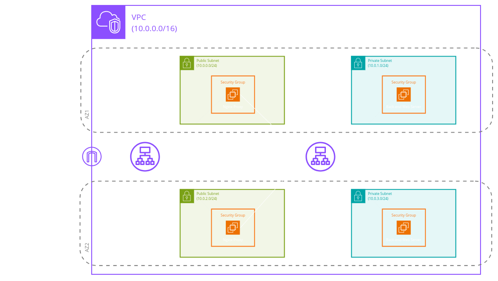
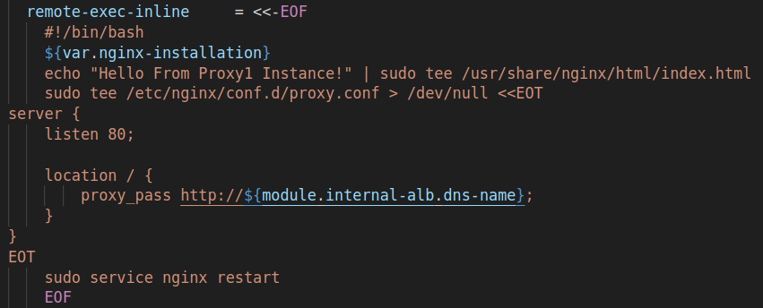
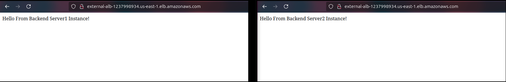
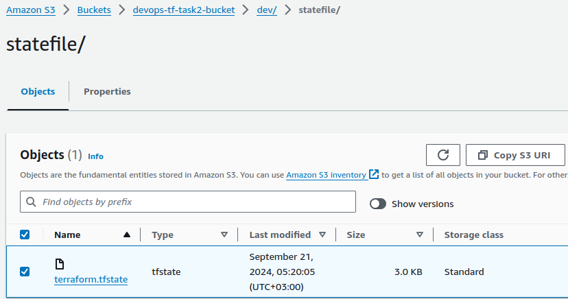

1. Don't work in the default workspace. Create a new workspace called `dev`.
    In VS Code's terminal, execute:
    ```sh
    terraform workspace new dev
    ```
    You can confirm the workspace creation by executing:
    ```sh
    terraform workspace list
    ```
2. Use custom, non-public modules to implement the above diagram.
3. A remote bucket will be used for the state file.
4. Use the remote-exec provisioner to install NGINX on the machines, then use the local-exec provisioner to print all the IPs to a file called `all-ips.txt` in the following format:
    ```
    public-ip1 1.1.1.1
    public-ip2 2.2.2.2
    ```
5. The first load balancer is public, and the second one, which sends traffic to the private machines, is private.
Let me know if anything needs further clarification!
6. Screenshot from the configuration of the proxy:

7. Screenshot from the public dns of the load balancer when you send a traffic to it from a browser and it returns the content of the private EC2s:

8. Screenshot from the S3 bucket that contains the state file:


---

## Workflow
1. An **S3 bucket** for the remote state file and a **DynamoDB table** for state locking will be created **automatically** when executing `Start.sh`.
2. **Initialize** the workspace and **apply** resources.
3. The `main.tf` file will be executed, creating the VPC, subnets, internet gateway, route tables, and key pair.
4. A **temporary public EC2 instance** (defined in `backend.tf`), which will be terminated later, will be launched to access the internet, install, and configure NGINX.
5. An **AMI** (created in `backend.tf`) will be generated from the temporary EC2 instance, serving as an image for back-end servers (suitable for an auto-scaling group).
6. **Back-end servers** (defined in `backend.tf`), which are two EC2 instances using the previously created AMI, will be provisioned with a security group that only accepts traffic from the internal load balancer.
7. An **internal application load balancer** (defined in `third_layer.tf`) will be created with the back-end servers as its targets, accepting traffic only from the proxy servers.
8. **Public proxy servers** (defined in `second_layer.tf`) will be launched with a remote-exec provisioner to install NGINX from the internet using the internet gateway. These servers will be configured as proxy servers to forward traffic to the internal load balancer's DNS and accept traffic only from the external load balancer.
9. An **external application load balancer** will be created to accept traffic from the internet and forward it to the proxy servers.
Here’s the corrected version of point 10, integrated with the rest:
10. The temporary EC2 instance will be terminated after fulfilling its purpose.
11. **After 10 minutes** from resource creation, a background script (`End.sh`) will **destroy all resources**, including the S3 bucket and DynamoDB table, unless it is manually terminated.

---

## Automation Scripts
You won't need to execute any individual commands—just run `Start.sh`:
```sh
./Start.sh
```

### `Start.sh`
1. Uses the AWS CLI to create an S3 bucket and a DynamoDB table.
2. Creates a Terraform workspace called `dev`.
3. Initializes Terraform and applies the resources.
4. After resource creation, terminates the temporary EC2 instance used to create the AMI for the back-end servers.
5. Runs `End.sh` in the background.

### `End.sh`
1. Prints its process ID for manual termination if needed.
2. Sleeps for 10 minutes.
3. Destroys all resources managed by Terraform (automatic approval).
4. Uses the AWS CLI to empty the S3 bucket (including versions, markers, and contents) and deletes the DynamoDB table.

---
